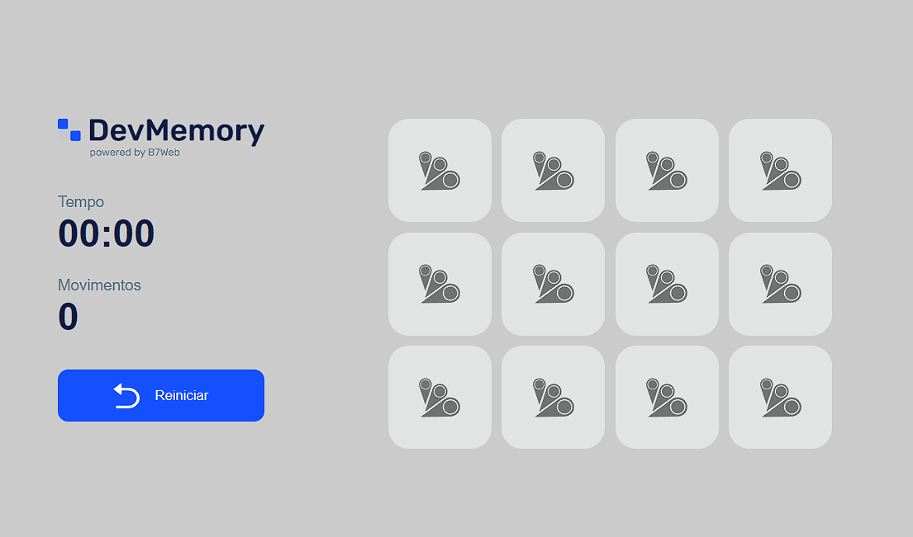

# Jogo da memória

Projeto realizado em 
 (Vite) + 
 + 
 
fazendo um jogo da memória.

 

- Projeto desenvolvido durante o curso da B7Web.

 

## Link do projeto:
### [Acesse aqui!](https://jogo-da-memoria-gules.vercel.app/)

 

 

#### Instalação caso queira instalar:
- `npm install` 

#### Para rodar:
- `npm run dev` 

 

 

